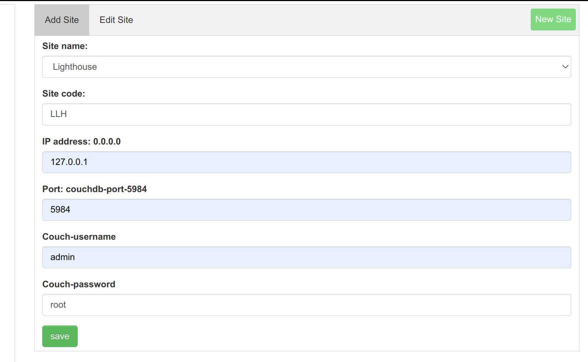
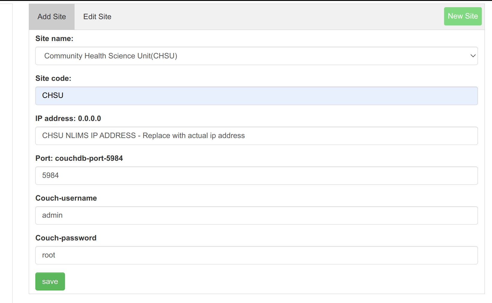
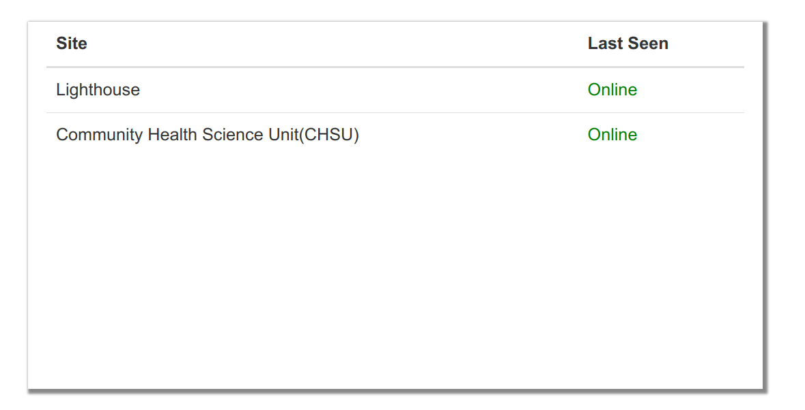

# NLIMS DATA SYNCHRONISER SETUP

## Prerequisites

Before installing `NLIMS DATA SYNCHRONISER`, ensure that the following requirements are met:

- Ruby 2.5.3
- MySQL 5.6
- Rails 5
- Couchdb 3.2.1

## Installing CouchDB
Install by following this guide: [Couchdb installation](https://github.com/HISMalawi/couchdb_installation/tree/main)

## Configuration

1. Checkout to the ```master``` branch
   ```bash
   git checkout master
   ```
2. Open the respective configuration files in the `config` folder: Copy the .example file to respective .yml file e.g  
   ```bash
   cp database.yml.example database.yml
   ```

   - `database.yml`: Configure your database settings. **Same database as nlims_controller**
   - `couchdb.yml`: Configure your CouchDB settings. **This should be the same as that of nlims_controller**
   - `application.yml`: Edit application-specific configurations as required.

3. Update the configuration settings in these files to match your environment.

## Installation

1. Install project dependencies using Bundler. Run the following command in your project directory:

   ```bash
   bundle install
   ```
## First-Time Setup

If you are installing the app for the first time, follow these steps:

1. Create the database:

   ```bash
   rails db:create
   ```
2. Run database migrations:

   ```bash
   rails db:migrate
   ```
## NLIMS DATA SYNCHRONISER Already Installed

If you already have NLIMS DATA SYNCHRONISER running, check the following if they are ok:

1. ```couchdb.yml``` config file is the same as that of ```nlims_controller```
2. If you access it via the browser(usually runs on port 3008): the interface has CHSU and the local site the last seen status as ```online```
3. Make sure the the local site name displayed is the same as that written to ```application.yml``` config file otherwise rename the name in the file to that being displayed on the interface.

## Setting up NLIMS DATA SYNCHRONISER to Communicate with CHSU NLIMS
1. Access the application on the browser and navigate to ```New site``` button and add ```NLIMS CHSU``` configuration as below: 
2. Add ```Local site``` so that its able to communicate with NLIMS CHSU via the ```Add Site``` button, The local site name should be the same as that in the ```application.yml``` of the config folder. Should the site name not appear on the list of site when ```add site``` button is pressed, Add the site via ```new site``` button and come back to ```add site``` section and search through the list to find the created site: 
3. Add  NLIMS CHSU so that its able to communicate with local site via the ```Add Site``` button: 
4. Add the 2 site should result in this communication:
5. If you made a mistake you can edit these via ```Edit site``` section. In this section you can disable and enable the sites for syncing.

## Cronjob for periodic syncing between local and chsu
```bash
0 * * * * /bin/bash -l -c 'cd /var/www/nlims_data_syncroniser/ && rvm use 2.5.3 && RAILS_ENV=development bundle exec rake nlims:sync_from_couchdb_to_couchdb --silent >> log/sync_couchdb_to_couchdb.log 2>&1'
```